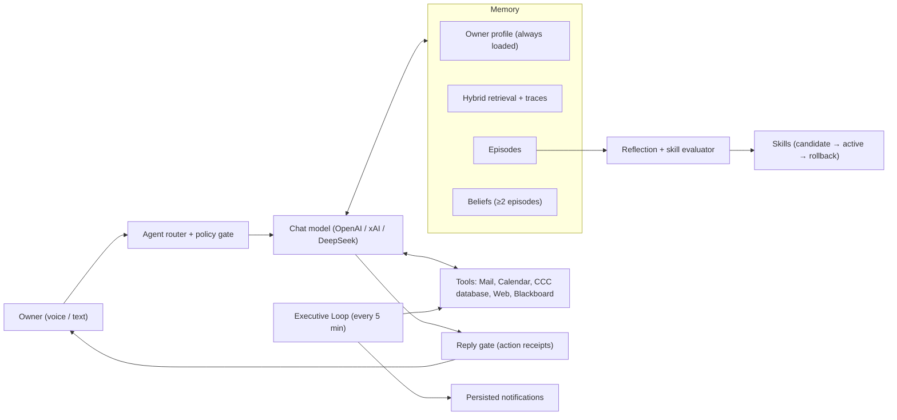

# AURA

**A proactive, voice-first AI assistant that remembers, retrieves, and learns from evidence instead of vibes.**

Most "AI assistant" projects stop at wrapping an LLM in a chat window. I built AURA to work on the data science underneath that wrapper:

- How do you make a system remember the *right* things?
- How do you retrieve them in a way you can inspect and explain?
- How do you let it improve itself without letting it quietly get worse?

AURA runs every day against my real email, calendar, coursework deadlines, and business data for Credit Comeback Club. That means every design decision here had to hold up on messy, real input, not just a demo dataset.

> Full configuration and operations reference: **[docs/OPERATIONS.md](docs/OPERATIONS.md)** · Testing philosophy: **[EVALS.md](EVALS.md)** · Learning roadmap: **[LEARNING_ROADMAP.md](LEARNING_ROADMAP.md)**

---

## The interesting parts

### 1. Hybrid retrieval with an inspectable ranking function
Memory recall isn't a raw vector-database lookup. Each candidate memory gets a combined score from five signals:

| Signal | What it captures |
|---|---|
| Vector similarity | Semantic meaning (`text-embedding-3-small`, pgvector) |
| Lexical overlap | Exact terms that embeddings can blur |
| Named-entity overlap | People, clients, and organizations mentioned |
| Recency | How fresh the memory is |
| Confidence | How well-supported the memory is |

One design choice matters most here: **recency and confidence can only refine a memory that already matches. They can't make an unrelated memory look relevant.** Relevance is filtered on the unboosted match first.

Every recall writes a private **retrieval trace** that records what was scored, each score component, why it matched, its source, and its age. The ranking function stays open to inspection instead of becoming a black box. → `retrieval_scoring.js`, `retrieval_trace_store.js`

### 2. Embeddings decoupled from the chat model
Long-term memory always runs on OpenAI embeddings, no matter which model is answering (OpenAI, xAI, or DeepSeek). That turns the chat model into a swappable variable I can compare (`npm run eval:compare`) without changing retrieval quality underneath it. It's a controlled experiment built into the architecture. → `model_router.js`

### 3. Evidence-gated skill learning (offline eval + guarded rollout)
AURA can write its own procedural "skills" from experience, but nothing ships blind:

- A new skill starts as an invisible **candidate**.
- It's replayed against **at least two sanitized historical scenarios** and has to average a score of **≥ 0.75**.
- A patch to an existing skill has to beat the active version by **≥ 0.05**.
- Deterministic checks reject secrets, prompt injection, authorization bypasses, and self-modification.
- In production, **two negative owner corrections, or three hard failures in the last five uses, trigger an automatic rollback.**

This is the same pattern as offline evaluation plus a canary rollout, applied to an agent's behavior instead of a model's weights. → `skill_evaluator.js`, `skill_outcome_store.js`, `durable_skills_store.js`

### 4. Belief consolidation over noisy signals
AURA separates **episodes** (what happened) from **beliefs** (what's generally true). A belief is only promoted when **at least two real episodes** support it at **≥ 0.75 confidence**. Conflicting evidence marks the belief **contested** instead of silently overwriting it, and a contested belief has to be clarified before AURA acts on it. In plain terms: don't trust n = 1. → `belief_store.js`

### 5. Proactive inference: designing the signal
The **Executive Loop** runs every five minutes. It scores new email, calendar changes, upcoming meetings, and promises I make in sent mail ("I'll send it by Friday"), then decides what's actually worth surfacing. Its first run baselines the current state so it doesn't replay old noise. The interesting problem wasn't calling an LLM. It was deciding what counts as a signal. → `executive_loop.js`, `goal_signal_matcher.js`

### 6. Safety as a design constraint, not an afterthought
- Tool results, emails, web pages, and database values are treated as **untrusted data, never instructions**.
- A **reply gate** blocks the assistant from claiming an action succeeded until the tool returns a matching receipt from the current turn. → `action_receipts.js`
- Deletions are **staged for owner approval** rather than executed immediately. → `owner_approval.js`
- Tools are classified as read-only, reversible writes, or blocked. → `agent_policy.js`

---

## Architecture

---

## Evaluation

I try to be honest about what's tested and what isn't. [EVALS.md](EVALS.md) marks the difference explicitly.

| Layer | Command | What it checks |
|---|---|---|
| Unit / regression | `npm test` | Tool policy, memory extraction and dedup, summary-poisoning guard, business logic, web-search rate limits. No network, all mocked. |
| Persona guard | `npm test` (`test/persona.test.js`) | That safety-critical instructions in `SOUL.md` haven't silently regressed |
| Live behavioral | `npm run eval` | Real model-in-the-loop cases: does AURA pick the right tool for the job? |
| Model comparison | `npm run eval:compare` | The same cases run across chat providers |
| Retrieval benchmark | `npm run bench:retrieval` | Offline ranking quality of the production scorer vs. ablations, with bootstrap CIs |
| Syntax gate | `npm run check` | Every loaded module parses |

### Retrieval benchmark: my hybrid scorer loses to vector-only

`npm run bench:retrieval` runs an offline, deterministic benchmark: 180 fictional memories, 84 labeled queries (35 dev / 49 test), cached `text-embedding-3-small` vectors, and the **real production scoring functions**, with a parity test that fails if the benchmark ever drifts from production. On the held-out test split:

| Config | MRR | Recall@1 | nDCG@4 |
|---|---|---|---|
| Full hybrid (production) | 0.736 [0.649, 0.827] | 0.512 | 0.801 |
| Vector-only | 0.847 [0.762, 0.925] | 0.702 | 0.873 |
| Paired difference (full − vector) | **−0.111 [−0.190, −0.040]** | | **−0.071 [−0.126, −0.021]** |

Both paired 95% bootstrap intervals exclude zero: on this fixture, the extra signals make ranking measurably worse. The diagnosis is a scale mismatch. `entityMatchScore` saturates at 1.0 on a single shared name (0.85 after weighting), while relevant cosine similarities sit around 0.57 (max 0.77). So a memory that merely *mentions* the right person outranks the memory that *answers* the question. All 16 test queries where the two rankers disagreed on the top result were decided by the entity signal; vector-only was better on 10 of them, hybrid on 1.

Caveats: the data is synthetic with machine-generated labels, and Recall@4 is saturated, so the benchmark discriminates on ordering rather than recall. Production scoring is unchanged; the next step is to test a fix (capping the entity contribution, or learning the combination weights) here first, then against owner-reviewed retrieval traces. Full write-up: [eval/retrieval/results/REPORT.md](eval/retrieval/results/REPORT.md) · labeling method: [eval/retrieval/LABELING.md](eval/retrieval/LABELING.md).

---

## Tech stack

**Runtime:** Node.js 20 · Express · Socket.IO · WebSockets

**Data:** Supabase (Postgres + pgvector) · SQLite (local mode)

**Models:** OpenAI (chat, embeddings, Whisper) · xAI · DeepSeek · Cartesia (speech) · Deepgram (live transcription)

**Deploy:** Render · Docker · Tailscale (private phone access)

---

## Quickstart

1. Install Node.js 20+ and run `npm install`.
2. Copy `.env.example` to `.env` and fill in credentials.
3. Run `supabase_setup.sql` once in the Supabase SQL editor.
4. `npm start`, then open `http://localhost:3000`.

Phone access, voice tuning, cloud migration, and every endpoint are documented in **[docs/OPERATIONS.md](docs/OPERATIONS.md)**.

---

## What I learned building this

The hardest problems in this project weren't the LLM calls. They were the classic data science problems underneath:

- **Ranking:** which memory matters right now?
- **Evaluation:** how do I know a change made things better?
- **Evidence thresholds:** when is a pattern real?
- **Data provenance:** where did this "fact" come from, and can I trust it?

AURA is where my coursework in data science and machine learning meets a system running against real data every day.

*Built by [Chris Holland](https://www.linkedin.com/in/itschrisholland/).*
